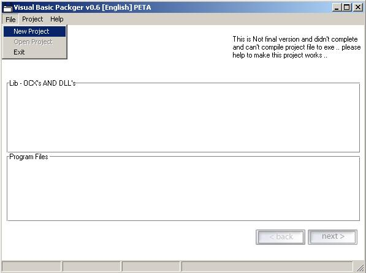

## VB Packager \[English\] v\.0\.7 \- Update in 29 July 2006

### Description

VB Packager [English] v.0.7

v.0.7 - Has been Published in 29 July 2006 - Unfinished Version

The reason of the project to make EXE file to run it's own , without needed of ActiveX or Ocx Or Dll , all you need to do is scan the project file to view all the dependence files and put in on the final exe file complied .. As like VB PowerWrap / Alloy / Stand Alone Xpress

You also can join this project ..

Website :

http://sourceforge.net/projects/vbpackcompile/
 
### More Info
 

             |
---                |---
**Submitted On**   |2006-07-29 06:47:52
**By**             |[Sharif aly Fouad](https://github.com/Planet-Source-Code/PSCIndex/blob/master/ByAuthor/sharif-aly-fouad.md)
**Level**          |Intermediate
**User Rating**    |5.0 (15 globes from 3 users)
**Compatibility**  |VB 6\.0
**Category**       |[Coding Standards](https://github.com/Planet-Source-Code/PSCIndex/blob/master/ByCategory/coding-standards__1-43.md)
**World**          |[Visual Basic](https://github.com/Planet-Source-Code/PSCIndex/blob/master/ByWorld/visual-basic.md)
**Archive File**   |[VB\_Package2009437282006\.zip](https://github.com/Planet-Source-Code/sharif-aly-fouad-vb-packager-english-v-0-7-update-in-29-july-2006__1-61388/archive/master.zip)

